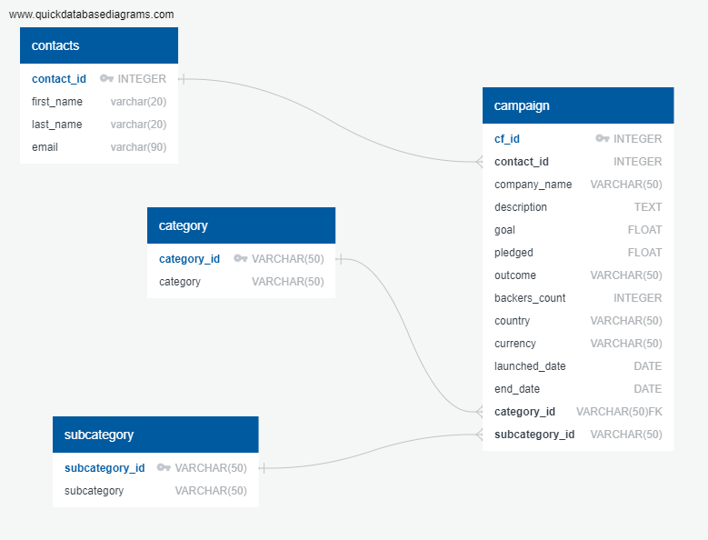

# Crowdfunding_ETL
## Part -1 :- Create the Category and Subcategory DataFrames
1. Extract and transform the crowdfunding.xlsx Excel data to create a category DataFrame that has the following columns:
    1. A "category_id" column that has entries going sequentially from "cat1" to "catn", where n is the number of unique categories
    2. A "category" column that contains only the category titles
    3. The following image shows this category DataFrame:
        ### Category DataFrame
        

2. Export the category DataFrame as category.csv and save it to your GitHub repository.
    ### Export CSV Code
    

4. Extract and transform the crowdfunding.xlsx Excel data to create a subcategory DataFrame that has the following columns:
   1. A "subcategory_id" column that has entries going sequentially from "subcat1" to "subcatn", where n is the number of unique subcategories
   2. A "subcategory" column that contains only the subcategory titles
   3. The following image shows this subcategory DataFrame:
        ### Sub_Category DataFrame
        

5. Export the subcategory DataFrame as subcategory.csv and save it to your GitHub repository.
    ### Export CSV Code
    

## Part -2 :- Create the Campaign DataFrame
1. Extract and transform the crowdfunding.xlsx Excel data to create a campaign DataFrame has the following columns:
    1. The "cf_id" column
    2. The "contact_id" column
    3. The "company_name" column
    4. The "blurb" column, renamed to "description"
    5. The "goal" column, converted to the float data type
    6. The "pledged" column, converted to the float data type
    7. The "outcome" column
    8. The "backers_count" column
    9. The "country" column
    10. The "currency" column
    11. The "launched_at" column, renamed to "launch_date" and with the UTC times converted to the datetime format
    12. The "deadline" column, renamed to "end_date" and with the UTC times converted to the datetime format
    13. The "category_id" column, with unique identification numbers matching those in the "category_id" column of the category DataFrame
    14. The "subcategory_id" column, with the unique identification numbers matching those in the "subcategory_id" column of the subcategory DataFrame
    15. The following image shows this campaign DataFrame:
          ### Campaign DataFrame
           
            
           

2. Export the campaign DataFrame as campaign.csv and save it to your GitHub repository.
   ### Export CSV Code
    

## Part -3 :- Create the Contacts DataFrame (WE chose the Option 1)
1. Choose one of the following two options for extracting and transforming the data from the contacts.xlsx Excel data:
      1. Option 1: Use Python dictionary methods.
      2. Option 2: Use regular expressions.

2. If you chose Option 1, complete the following steps:
   1. Import the contacts.xlsx file into a DataFrame.
   2. Iterate through the DataFrame, converting each row to a dictionary.
   3. Iterate through each dictionary, doing the following:
         1. Extract the dictionary values from the keys by using a Python list comprehension.
         2. Add the values for each row to a new list.
    4. Create a new DataFrame that contains the extracted data.
    5. Split each "name" column value into a first and last name, and place each in a new column.
    6. Clean and export the DataFrame as contacts.csv and save it to your GitHub repository.
        ### Export CSV Code
        

3. Check that your final DataFrame resembles the one in the following image:
    ### Contact Dataframe
    

## Part -4 :- Create the Crowdfunding Database
1. Inspect the four CSV files, and then sketch an ERD of the tables by using QuickDBD

    ### ERD Diagram
    
2. Use the information from the ERD to create a table schema for each CSV file.
3. Save the database schema as a Postgres file named crowdfunding_db_schema.sql, and save it to your GitHub repository.
4. Create a new Postgres database, named crowdfunding_db.
5. Using the database schema, create the tables in the correct order to handle the foreign keys.
6. Verify the table creation by running a SELECT statement for each table.
7. Import each CSV file into its corresponding SQL table.
8. Verify that each table has the correct data by running a SELECT statement for each.

## Select Query Results
1. Select Category Query Result
2. 
3. Select Sub_Category Query Result
. 
5. Select Contact Query Result
. 
7. Select Campaign Query Result
. 
   
